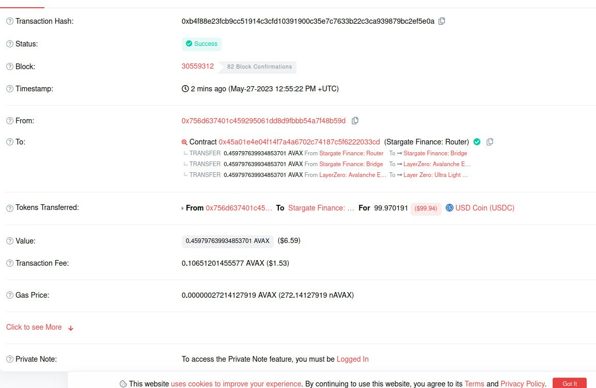
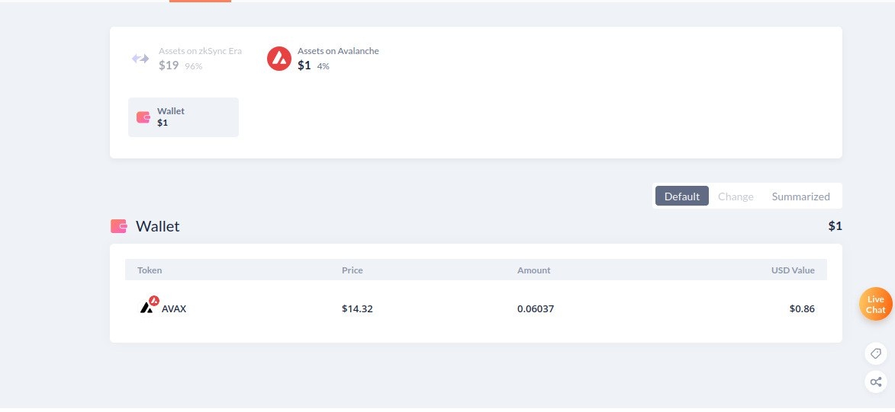

##### Описание 

***Успешная транзакция***


***Оставшийся баланс***


***Описание:***
После написания кода у меня прошла транзакция, хотел улучшить работу кода, однако после начались проблемы с обработкой газа в большинстве своем из-за перегруженности сети и все последующие транзакции не пропускали. Транзакции обрабатывались очень долго, а разработчики Stargate Finance очень долго отвечают, реже, чем раз в 7 часов. Так как истекает срок сдачи задания высылаю код, который успел сделать.

С уважением, Семён
##### УСТАНОВКА ПРОЕКТА

1. Скачайте репозитрой с GitHub:

```git clone https://github.com/MrrDino/Stargate-swap.git```

2. Перейдите в configs/configs.yaml и внесите данные для успешной работы:


    AVALANCHE_NODE -> rpc нода для сети Avalanche (alchemy/ankr)
    POLYGON_NODE -> rpc нода для сети Polygon (alchemy/ankr)
    PRIVATE_KEY -> приватный ключ
    WALLET_ADDRESS -> адрес кошелька

3. Откройте консоль и перейдите в место хранения проекта:

```cd .../stargate_transfer```

4. Введите следующую команду:

```docker-compose up```

5. Проект соберется и вы увидете вывод похожий на этот:

