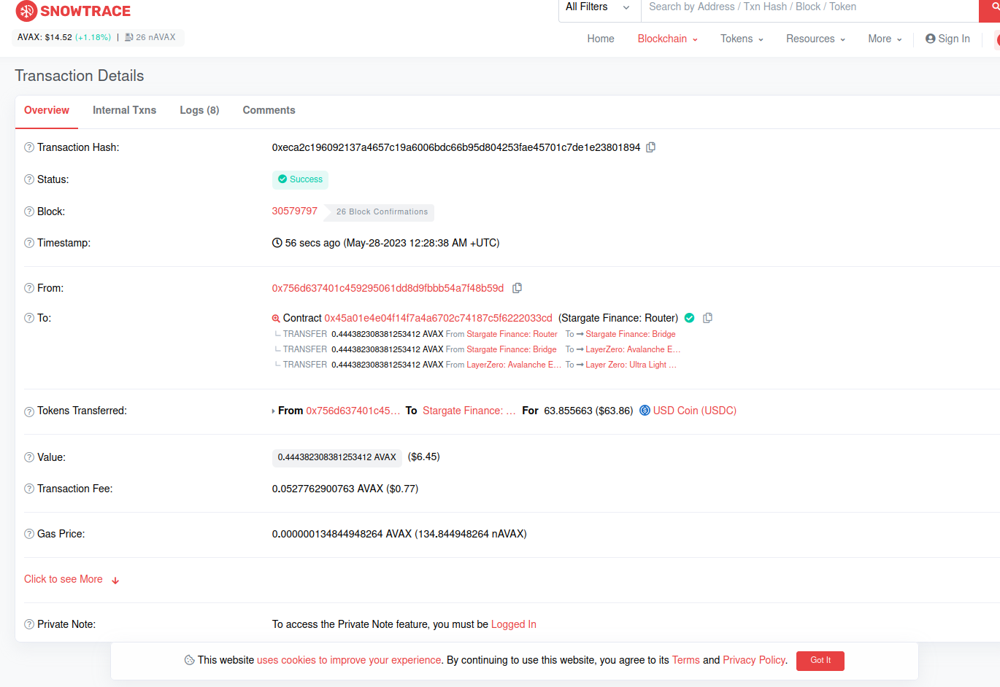
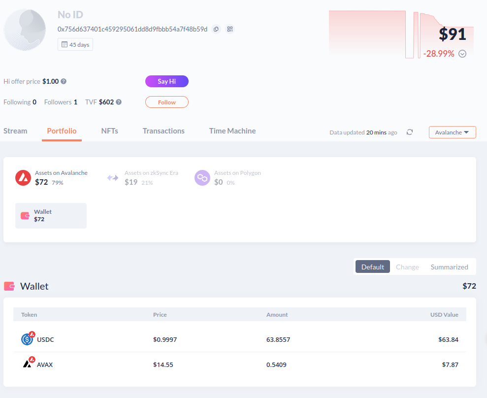
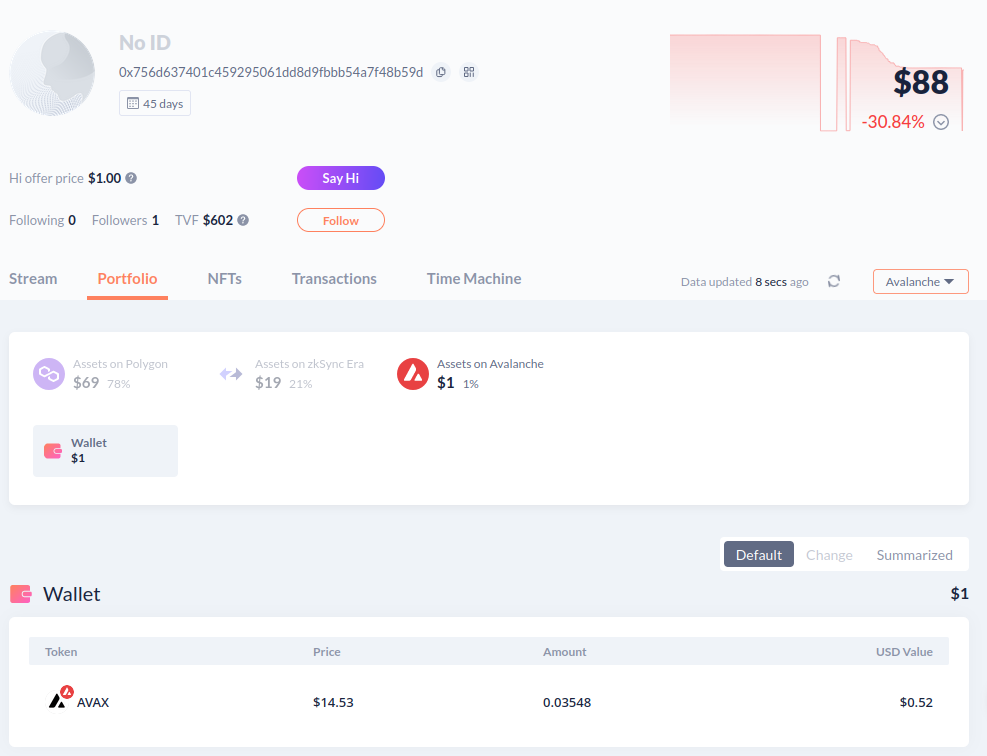
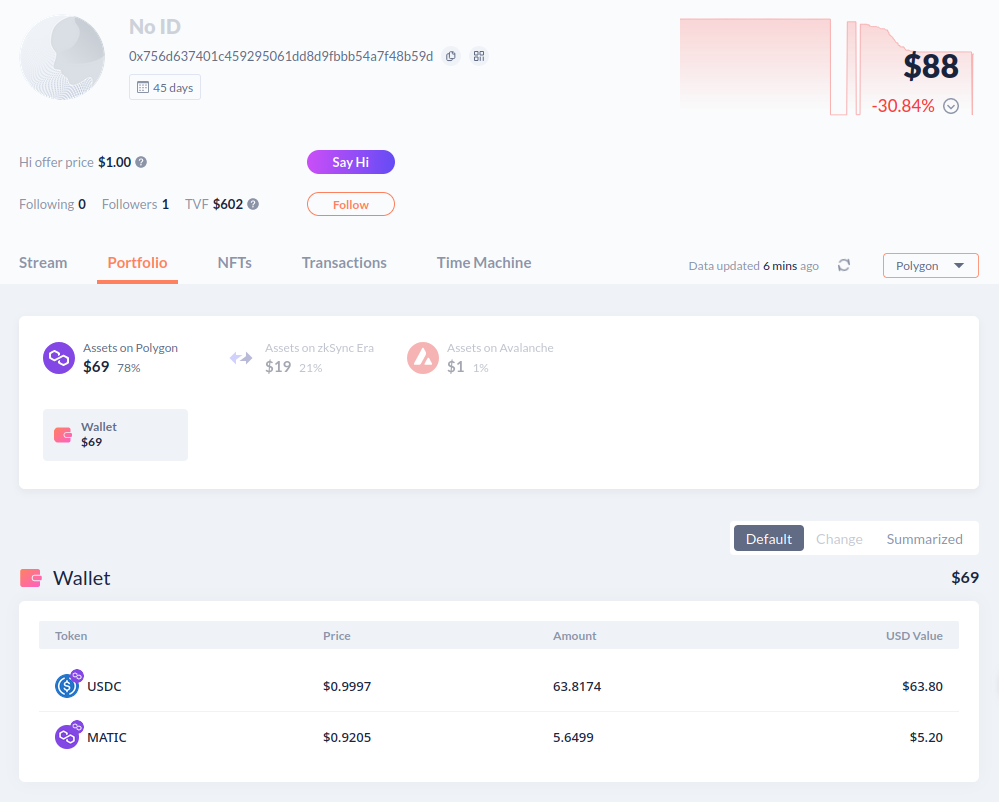
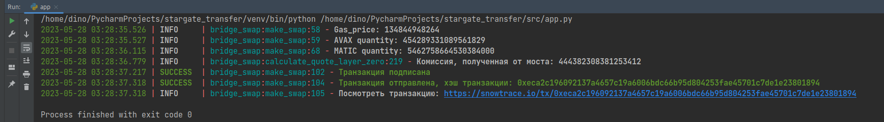
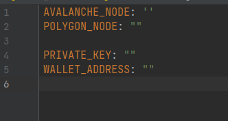
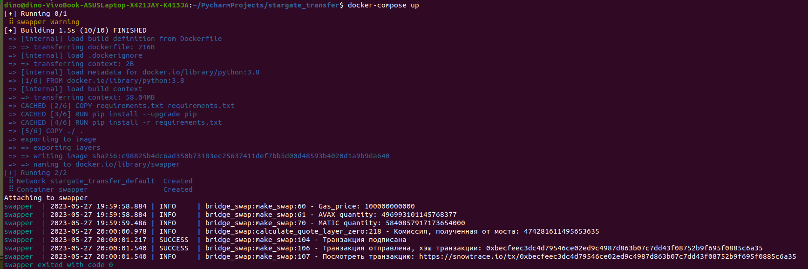

# ОПИСАНИЕ 

### [Транзакция](https://snowtrace.io/tx/0xeca2c196092137a4657c19a6006bdc66b95d804253fae45701c7de1e23801894 "Транзакция")

***Отображение в Snowtrace***


***Баланс на Avalanche до отправки транзакции***


***Баланс на Avalanche после отправки транзакции***


***Баланс на Polygon после отправки транзакции***


***Отображение транзакции в командной строке***



***Описание:***
поскольку скорость была не важна, сделал синхронно, прекрасно понимаю, что асинхронный код в данном случае был бы уместнее, но последние два мост был достаточно загружен и я столкнулся с долгой обработкой транзакций, поэтому не стал затягивать с заданием и переделывать.

С уважением, Семен.

# УСТАНОВКА ПРОЕКТА

1. Скачайте репозитрой с GitHub:

```git clone https://github.com/MrrDino/Stargate-swap.git```

2. Перейдите в configs/configs.yaml и внесите данные для успешной работы:




| Параметр       | Описание                                   |
|:--------------:|:------------------------------------------:|
| AVALANCHE_NODE | rpc нода для сети Avalanche (alchemy/ankr) |
| POLYGON_NODE   | rpc нода для сети Polygon (alchemy/ankr)   |
| PRIVATE_KEY    | приватный ключ                             |
| WALLET_ADDRESS | адрес кошелька                             |

3. Откройте консоль и перейдите в место хранения проекта:

```cd .../stargate_transfer```

4. Введите следующую команду:

```docker-compose up```

5. Проект соберется и вы увидете вывод похожий на этот:

